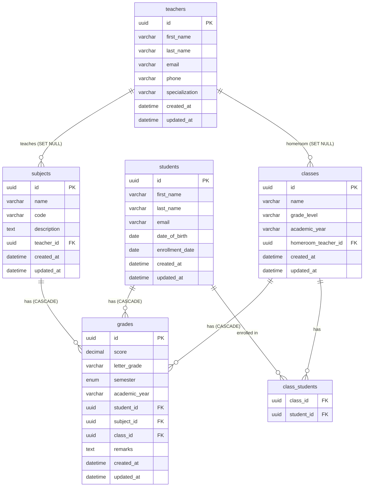

# School Management API

A RESTful API built with **NestJS**, **TypeORM**, and **MySQL** for managing teachers, subjects, students, classes, and grades.

## Tech Stack

- **Runtime:** Node.js 18+
- **Framework:** NestJS 10
- **ORM:** TypeORM 0.3
- **Database:** MySQL 8
- **Validation:** class-validator / class-transformer
- **Docs:** Swagger / OpenAPI

## Project Structure

```
src/
├── common/
│   ├── exceptions/        # Custom HTTP exceptions
│   ├── filters/           # Global exception filter
│   └── interceptors/      # Response transform interceptor
├── config/
│   └── database.config.ts # TypeORM config via @nestjs/config
├── database/
│   ├── data-source.ts     # Standalone DataSource (seed / migrations)
│   └── seed.ts            # Database seeder
└── modules/
    ├── teachers/
    ├── subjects/
    ├── students/
    ├── classes/
    └── grades/
assets/
└── collection/
    └── school-management.postman_collection.json
```

Each module follows the same layered structure:

```
<module>/
├── dto/                   # create + update DTOs (class-validator)
├── entities/              # TypeORM entity
├── interfaces/            # Repository interface (extends IBaseRepository)
├── repositories/          # TypeORM repository implementation
├── <module>.controller.ts
├── <module>.service.ts
└── <module>.module.ts
```

## Data Model



## Getting Started

### Prerequisites

- Node.js 18+
- MySQL 8 running on `localhost:3306`

### 1. Install dependencies

```bash
npm install
```

### 2. Configure environment

Copy `.env.example` to `.env` and adjust values if needed:

```bash
cp .env.example .env
```

```env
DB_HOST=localhost
DB_PORT=3306
DB_USERNAME=root
DB_PASSWORD=root
DB_DATABASE=school_management
PORT=3000
NODE_ENV=development
```

### 3. Create the database

```bash
# MySQL CLI
mysql -u root -p -e "CREATE DATABASE IF NOT EXISTS school_management CHARACTER SET utf8mb4 COLLATE utf8mb4_unicode_ci;"

# or via Docker
docker exec <container> mysql -u root -proot -e "CREATE DATABASE IF NOT EXISTS school_management CHARACTER SET utf8mb4 COLLATE utf8mb4_unicode_ci;"
```

### 4. Seed the database

Tables are auto-created by TypeORM (`synchronize: true` in development). The seed script also handles this:

```bash
npm run seed
```

Inserts: 3 teachers, 4 subjects, 6 students, 2 classes, 21 grade records.

### 5. Start the server

```bash
# development (watch mode)
npm run start:dev

# production build
npm run build
npm run start:prod
```

The API is available at `http://localhost:3000/api`.
Swagger docs at `http://localhost:3000/api/docs`.

## API Reference

All responses are wrapped in a standard envelope:

```json
{
  "success": true,
  "data": { },
  "timestamp": "2024-06-01T00:00:00.000Z"
}
```

Errors follow:

```json
{
  "statusCode": 404,
  "error": "Not Found",
  "message": "Teacher with id \"<uuid>\" not found",
  "timestamp": "2024-06-01T00:00:00.000Z",
  "path": "/api/teachers/<uuid>"
}
```

### Teachers `/api/teachers`

| Method | Path | Description |
|--------|------|-------------|
| GET | `/teachers` | List all teachers |
| GET | `/teachers/:id` | Get teacher by ID |
| POST | `/teachers` | Create teacher |
| PUT | `/teachers/:id` | Update teacher (partial) |
| DELETE | `/teachers/:id` | Delete teacher |
| GET | `/teachers/:id/subjects` | Subjects taught by teacher |
| GET | `/teachers/:id/classes` | Classes where teacher is homeroom |

### Subjects `/api/subjects`

| Method | Path | Description |
|--------|------|-------------|
| GET | `/subjects` | List all subjects |
| GET | `/subjects/:id` | Get subject by ID |
| POST | `/subjects` | Create subject |
| PUT | `/subjects/:id` | Update subject (partial) |
| DELETE | `/subjects/:id` | Delete subject |

### Students `/api/students`

| Method | Path | Description |
|--------|------|-------------|
| GET | `/students` | List all students |
| GET | `/students/:id` | Get student by ID |
| POST | `/students` | Create student |
| PUT | `/students/:id` | Update student (partial) |
| DELETE | `/students/:id` | Delete student |
| GET | `/students/:id/grades` | All grades for a student |
| GET | `/students/:id/classes` | Classes a student is enrolled in |

### Classes `/api/classes`

| Method | Path | Description |
|--------|------|-------------|
| GET | `/classes` | List all classes |
| GET | `/classes/:id` | Get class by ID (includes enrolled students) |
| POST | `/classes` | Create class |
| PUT | `/classes/:id` | Update class (partial) |
| DELETE | `/classes/:id` | Delete class |
| GET | `/classes/:id/students` | List students in class |
| POST | `/classes/:id/enroll` | Enroll a student `{ studentId }` |
| DELETE | `/classes/:id/unenroll/:studentId` | Unenroll a student |

### Grades `/api/grades`

| Method | Path | Description |
|--------|------|-------------|
| GET | `/grades` | List all grades |
| GET | `/grades/:id` | Get grade by ID |
| GET | `/grades/report/student/:studentId` | Grade report grouped by subject with averages |
| POST | `/grades` | Create grade |
| PUT | `/grades/:id` | Update grade (partial, recomputes letter grade) |
| DELETE | `/grades/:id` | Delete grade |

`letterGrade` is computed automatically from `score` on every create/update:

| Score | Letter |
|-------|--------|
| 90–100 | A |
| 80–89 | B |
| 70–79 | C |
| 60–69 | D |
| < 60 | F |

## Postman Collection

Import `assets/collection/school-management.postman_collection.json` into Postman.

- Set `{{base_url}}` to `http://localhost:3000/api` (already the default)
- Create requests auto-capture IDs into `{{teacher_id}}`, `{{subject_id}}`, `{{student_id}}`, `{{class_id}}`, `{{grade_id}}` via test scripts

## Scripts

| Command | Description |
|---------|-------------|
| `npm run start:dev` | Start with hot reload |
| `npm run build` | Compile TypeScript |
| `npm run start:prod` | Run compiled output |
| `npm run seed` | Drop and reseed the database |
| `npm run test` | Run unit tests |
| `npm run test:e2e` | Run end-to-end tests |
| `npm run test:cov` | Test coverage report |
| `npm run lint` | Lint and auto-fix |
| `npm run format` | Prettier format |
